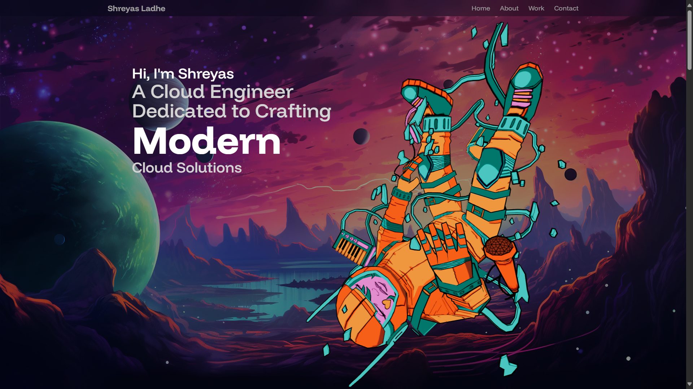
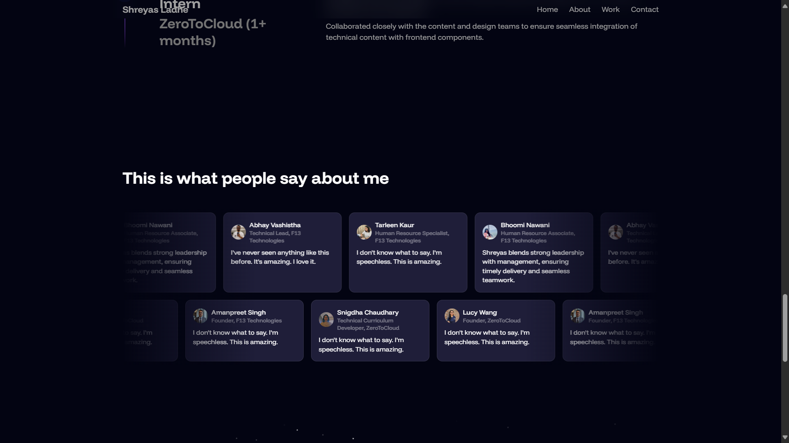
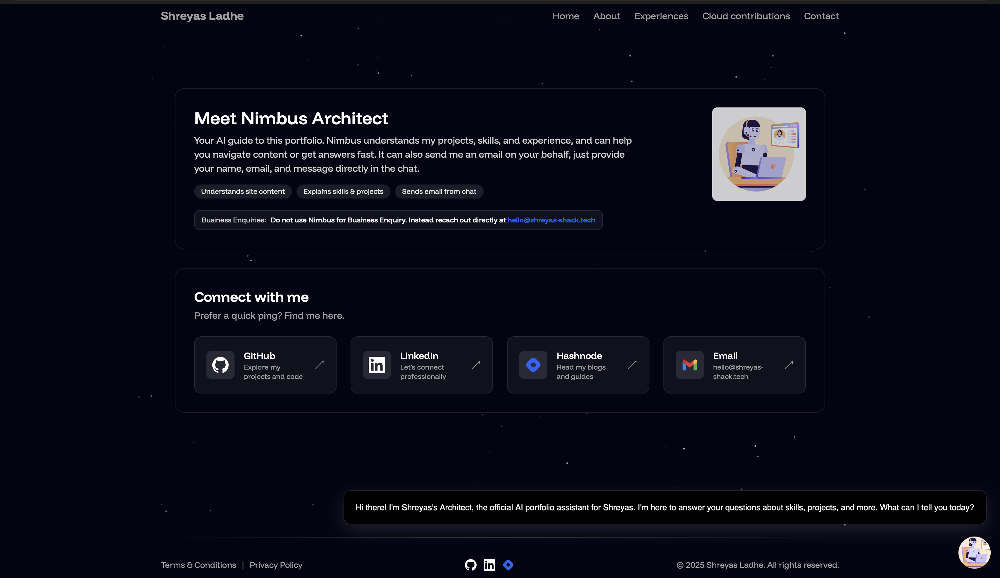

# Shreyas Portfolio

A modern, performant portfolio showcasing my projects, certifications, cloud experience, and writing. Built with React + Vite + Tailwind, enhanced with subtle 3D/particle effects and a smart assistant, Nimbus Architect, to help visitors explore content and reach me quickly.

## ✨ Highlights

- Polished, responsive UI with tasteful animations and dark theme
- Structured content powered by a single source of truth (`src/constants/index.js`)
- Dedicated sections for Projects, Solutions Architecture write-ups, Experience, Testimonials, and Cloud Contributions
- Certifications grid with issuer-based themes (AWS, Oracle, Others)
- “Nimbus Architect” AI assistant embedded site-wide to answer questions and collect messages
- Accessible, keyboard-friendly interactions and semantic HTML

## 🧭 Table of contents

- Features in detail
- Tech stack
- Project structure
- Local development
- Configuration & content
- Deployment
- Screenshots
- Contact

## 🚀 Features (in detail)

- Projects showcase
  - Cards with logo, description, key tech logos, and links
  - Optimized images from `public/assets/projects/*`
- Solutions Architecture case studies
  - Long-form content with headings, images, and external resources
  - Managed via `solutionsProjects` in `src/constants/index.js`
- Experience timeline
  - Company-wise roles, skills, and dates
- Testimonials
  - Short, high-signal endorsements with avatars
- Certifications
  - Issuer-aware styling: AWS (indigo theme), Oracle (cream), Others (modern dark purple)
  - Click-through to credential pages
- Cloud contributions
  - Free resources and handbooks with index modal
- Contact page
  - “Nimbus Architect” intro card explaining capabilities and a priority tip for recruiters
  - Expanded “Connect with me” panel with GitHub, LinkedIn, Hashnode, and Email
  - Tip for business enquiries to contact directly via email

## 🛠️ Tech stack

- React 18 + Vite
- Tailwind CSS
- Small visual effects components (particles, parallax, GSAP-friendly areas)
- Deployed to a static host (Vercel/Netlify/S3+CloudFront recommended)

Note: The legacy EmailJS contact form has been removed in favor of the embedded assistant. An optional serverless function exists at `api/send-email.js` if you want to wire it up later.

## 📁 Project structure

```
public/
  assets/            # Images, logos, project assets
  screenshots/       # PNGs used in README and site
src/
  components/        # Reusable UI (Particles, Cards, Loaders, etc.)
  sections/          # Page sections (Hero, About, Projects, Contact, etc.)
  pages/             # Route-level pages (Blog)
  constants/         # Content sources (projects, socials, experience, certifications)
  App.jsx            # App shell
  main.jsx           # Entry point
```

Key content file: `src/constants/index.js`

## ⚙️ Local development

Prerequisites:
- Node.js 18+

Install and run:

```bash
npm install
npm run dev
```

Build and preview production:

```bash
npm run build
npm run preview
```

## 🧩 Configuration & content

- Branding and theme
  - Tailwind config: `tailwind.config.js`
  - Global styles: `src/index.css`
- Content
  - Edit `src/constants/index.js` to update:
    - `myProjects`: title, description, subDescription, links, logos
    - `experiences`: companies, roles, skills
    - `reviews`: testimonials
    - `certifications`: name, issuer, date, logo, link
    - `solutionsProjects`: long-form case studies with content blocks
- Assets
  - Place logos and images under `public/assets/*`
  - Social icons under `public/assets/socials/*` (GitHub, LinkedIn, Hashnode, Gmail)
- Contact page
  - The “Nimbus Architect” section explains the assistant’s capabilities
  - The social panel links are defined inline in `src/sections/Contact.jsx`
  - Recruiters can add the keyword "Recruitment" in chatbot messages for priority

## 🤖 Nimbus Architect (assistant)

The assistant is embedded as a floating chat widget. It helps visitors:
- Discover relevant projects and pages
- Understand skills and certifications
- Send an email from inside the chat by providing name, email, and message
- Flag priority messages using the keyword "Recruitment"

If you want to change the chatbot ID, update the embed configuration where the script is initialized (see `src/App.jsx` or the layout where the embed is loaded, depending on your setup).

## 🚀 Deployment

Any static host works. Suggested options:
- Vercel: zero-config for Vite
- Netlify: drop the build output
- S3 + CloudFront: upload `dist/` and configure distribution

Typical steps (Vercel):
1. Push to GitHub
2. Import repo in Vercel
3. Build command: `npm run build`
4. Output directory: `dist`

## 📸 Screenshots





## 📬 Contact

- Email: `hello@shreyas-shack.tech`
- LinkedIn: `https://www.linkedin.com/in/shreyasladhe`
- GitHub: `https://github.com/ShreyasLadhe`
- Blog (Hashnode): `https://hashnode.com/@nimbusarchitect`

Thanks for visiting! If you’re a recruiter, include "Recruitment" in your chatbot message for priority handling.
